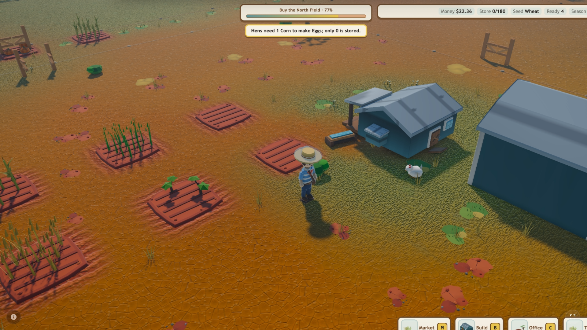

# AI Prompts for Game Development

The right AI prompts save both tokens and development time. They give the AI enough context to work with the systems that already exist instead of repeatedly rediscovering the project, duplicating code, replacing deliberate decisions, or rebuilding the same feature later.

This README is both a start-to-finish workflow and a reference guide. If you are starting a new game, follow the steps in order. If your game is already underway, jump to the section that matches the problem you need to solve.

Run one prompt at a time, review the result, and commit working changes before moving forward. Every prompt tells the AI to read, create, or update the relevant game documentation so later prompts can reuse decisions without spending tokens rediscovering them.

- [Example Working Game](https://www.glitch.fun/games/9a698a9d-1b27-4c78-9256-0f458368737d/play)
- [Open Source Code](https://github.com/Glitch-Gaming-Platform/Glitch-Games-FarmRise-Tycoon)
- [Explainer Video](https://youtu.be/rW4IriCvpyQ)

## This fork's local workbench

This fork adds locally versioned material for evaluating and applying the linked
workflow without treating external marketing claims or mutable hosted prompts as
project facts.

- [Agent operating rules](AGENTS.md)
- [Accepted development workflow and standardized feedback loop](docs/DEVELOPMENT_WORKFLOW.md)
  — coherent outcomes, verification cadence, failure evidence, visual review,
  and chat/context boundaries
- [Implementation roadmap](ROADMAP.md) — checkbox milestones and the continuation
  checkpoint for future context windows
- [Accepted native foundation](docs/decisions/0001-native-foundation.md) — C++
  primary track, Linux/Windows matrix, procedural-first asset rule, budgets, and
  dependency/license policy
- [Ubuntu 24.04 development setup](docs/setup/UBUNTU_24_04.md) — Phase 0 local
  toolchain and SDL3/OpenGL context diagnostic
- [Native Windows development setup](docs/setup/WINDOWS.md) — MSVC/CMake/Ninja
  installation and real-GPU OpenGL 4.6 context diagnostic
- [Local prompt library](prompts/README.md) — original adaptations covering all
  prompt topics linked below
- [Technology used by the example game](docs/TECH_STACK.md)
- [Custom C++ voxel-engine option](docs/VOXEL_ENGINE_OPTION.md)
- [Agent harness, MCP/skill review, and official technical references](docs/AGENT_HARNESS_AND_TOOLS.md)
- [Agentic workflow research](docs/research/agentic-development-workflow.md) and
  its [implementation plan](docs/plans/agentic-development-workflow.md)
- [Repository workflow skills](.agents/skills/) — deep research, planning from
  research, documentation sync, and end-of-session handoff
- [Glitch Analytics evaluation note](docs/ANALYTICS_NOTE.md)
- [Border-collie game concepts and recommended vertical slice](docs/game-design/WIDE_EYE.md)
- [Broader herding gameplay, reward, progression, scale, and animal direction](docs/game-design/HERDING_GAMEPLAY.md)
- [Sheep/dog behavior and flock-scale research](docs/research/herding-simulation-and-scale.md)
  with its bounded [implementation plan](docs/plans/herding-simulation-and-scale.md)
- [Formatted community production prompt](game-prompt.md) and its bounded
  [ultra production-pass adaptation](prompts/final-aaa-visual-optimization.md)

The local prompts are not verbatim mirrors of the hosted Glitch prompts. The
source playbook does not currently include a license, so these files preserve the
workflow ideas in new wording and add scope, evidence, privacy, and stop gates.

### Native scaffold commands

The current Phase 1 scaffold configures, builds, and tests with one checked-in
preset sequence:

```bash
cmake --preset dev
cmake --build --preset dev
ctest --preset dev
```

The [minimal Linux fast gate](.github/workflows/linux.yml) runs that same
sequence with Clang 18 on GitHub's Ubuntu 24.04 image. The default suite includes
the dummy-driver window lifecycle and other `headless` checks; it does not claim
the hosted runner provides the approved OpenGL 4.6 graphics baseline. Failed
jobs select their dependency, configure, build, CTest, and bounded environment
diagnostics for 14-day artifact retention. The workflow source and failure paths
have been validated locally; its first hosted run is not yet an observed result.

Replace `dev` with `dev-sanitized` for supported sanitizer coverage or
`release` for an optimized build. On a graphics target that provides the
approved OpenGL baseline, launch the interactive SDL window with:

```bash
./build/Linux/dev/wide_eye
```

The executable requests an OpenGL 4.6 Core debug context without a lower-version
or compatibility fallback, then reports the actual vendor, renderer, OpenGL
version, GLSL version, profile, and debug state. It installs a synchronous debug
callback, logs driver messages, and returns failure from a smoke run when any
high-severity message occurs. The interactive path presents one perspective
voxel cube with a 24-bit depth/8-bit stencil request, handles drawable resize,
minimize/restore, focus, and close events, and advances a monotonic 60 Hz fixed
step independently of rendering. Close it through the window manager, or run the
bounded context-only reporting path with:

```bash
./build/Linux/dev/wide_eye --context-smoke
```

On a capable graphics target, the hidden triangle smoke also draws one frame and
checks that the center framebuffer sample contains the triangle rather than the
clear color:

```bash
./build/Linux/dev/wide_eye --triangle-smoke
```

The corresponding cube smoke submits the farther face after the nearer face,
then verifies the center color and depth plus the active `LESS` comparison and
depth-write state. Add `--capture` to save its pre-swap RGBA8 framebuffer as a
deterministic PNG; the destination directory must already exist:

```bash
./build/Linux/dev/wide_eye --voxel-cube-smoke
mkdir -p artifacts/phase1/manual
./build/Linux/dev/wide_eye --voxel-cube-smoke \
  --capture artifacts/phase1/manual/voxel-cube.png
./build/Linux/dev/wide_eye --voxel-cube-debug-smoke \
  --capture artifacts/phase1/manual/voxel-cube-wireframe.png
```

The debug command uses the same cube geometry, camera, viewport, shader, and
depth state in triangle-wireframe mode. It is diagnostic evidence, not the
player-facing presentation or a future voxel/chunk debug view.

The default WSL suite includes a known-byte PNG-writer unit check, accepted
Tracer 0 baseline-integrity check, core timing, window-state, fatal-assertion,
and bounded `--window-smoke` lifecycle checks. The latter maps SDL resize,
minimize/restore, focus, and close events through the dummy video driver because
this WSL host exposes only OpenGL 4.5.
The display-backed context CTests are enabled by default on Windows; enable them
explicitly on a capable native Linux machine with
`-DWIDE_EYE_ENABLE_OPENGL_CONTEXT_TEST=ON`. From WSL, reproduce the native
Windows MSVC build, 15-test CTest suite, and project graphics report with:

```bash
powershell.exe -NoProfile -ExecutionPolicy Bypass \
  -File "$(wslpath -w ./tools/phase1/run-window-smoke.ps1)"
```

The native Windows runner executes 15 development CTests, including PNG known-
byte checks, accepted-baseline integrity, independent two-run normal and
wireframe-capture hash checks, timing, window-state, assertion, common failure-
diagnostic rejection, triangle, cube-depth, wireframe, and injected high-
severity oracles. It then retains the
direct normal/debug captures and reports in one timestamped packet under the
ignored `artifacts/phase1/<date>/` tree. Its versioned JSON manifest hashes the
retained log, configuration, observed state, source inventory, and both PNGs;
`review.md` carries the matching metadata and blank owner verdict. Failed
comparisons also keep the altered repeat PNG. A capture remains a candidate
until the owner explicitly accepts its visual-review packet. The first accepted
Tracer 0 packet is checked in under
[`tests/goldens/`](tests/goldens/tracer0/voxel_cube_smoke-v1/windows-intel-uhd-630-development/review.md);
its registered CTest verifies the retained hashes and recorded Accept verdict.

After configuring `dev`, run the project-only formatting and bounded static
analysis gates with:

```bash
cmake --build --preset dev --target format-check
cmake --build --preset dev --target clang-tidy-check
```

These targets require LLVM 18's `clang-format` and `clang-tidy`, use the
checked-in configurations, and enumerate only Wide Eye source files. Fetched or
installed third-party dependency sources are not included.

## Example Game Took 2 Days To Make

The example took 2 days to make, and it comes with a playable core loop, desktop and mobile optimization, asset pipelines, performance optimization, collision detection, sound affects, music loops, visual affects, onboarding, user progression, saving and loading, menu system, ability to distribute on other platforms, built-in analytics, a full testing suite and extensive documentation. This allows a full prototype of a game and to start getting feedback.

<p align="center">
  
  
</p>

### Refinement and Bugs Disclaimer
To be clear on expectations, with this process your game will still have bugs. It will need refinement. But the speed and the amount of tokes required to make those refinements and bug fixes will be a lot less than without properly structurally your game. The goal and outcome of this process is to reduce the amount of time and tokens you will use in developing your game and to develop higher quality games.

## Phase 1: Build the game

Use this phase to define the game, create its technical and creative foundations, and produce the first complete playable build.

## 1. Define the game

Write down the player fantasy, goal, pressure, defining twist, and core gameplay loop. If you do not know the mechanics yet, use the optional generator.

[Open the optional mechanics and core-loop generator](https://www.glitch.fun/publishers/tools/ai-game-development-prompts#game-design-generator)

## 2. Create the project architecture

Choose the engine you are actually using. This creates the project structure, dependency rules, tests, and AI instructions before the codebase becomes difficult to change. It also audits the locomotion, animation, collision bodies, hitboxes, hurtboxes, traces, game menus, HUD, button states, input navigation, procedural motion, VFX movement, physics reactions, and internationalization/localization architecture the approved game will need. Player-facing text should use stable translation keys from the start so additional languages do not require rebuilding finished gameplay and menus.

- [Three.js architecture](https://www.glitch.fun/publishers/tools/ai-game-development-prompts?prompt=threejs-game-architecture#prompt-picker) (beginners should choose this with a NextJS backend)
- [Unity architecture](https://www.glitch.fun/publishers/tools/ai-game-development-prompts?prompt=unity-game-architecture#prompt-picker)
- [Godot architecture](https://www.glitch.fun/publishers/tools/ai-game-development-prompts?prompt=godot-game-architecture#prompt-picker)
- [Unreal Engine architecture](https://www.glitch.fun/publishers/tools/ai-game-development-prompts?prompt=unreal-game-architecture#prompt-picker)

Set up remote automation while the architecture is still flexible. This gives AI agents and conventional test runners a secure game DOM, semantic actions, real input, screenshots, events, assertions, and CI access instead of making every future test depend on pixel guessing.

[Build a remote game automation tool](https://www.glitch.fun/publishers/tools/ai-game-development-prompts?prompt=remote-game-automation#prompt-picker)

## 3. Plan an optional backend (web games REQUIRED)

Accounts, multiplayer, purchases, cloud saves, leaderboards, and persistent economies need trusted server-side rules. Offline games may skip this step.

- [Build a secure game backend](https://www.glitch.fun/publishers/tools/ai-game-development-prompts?prompt=secure-game-backend#prompt-picker) (beginners should use Node/NextJS)
- [Create a reusable game SDK](https://www.glitch.fun/publishers/tools/ai-game-development-prompts?prompt=game-backend-sdk#prompt-picker) — optional when multiple clients or tools use the backend

## 4. Establish the visual standard

Create a visual rubric before generating large amounts of art. Use approved AAA games with a comparable genre, camera, platform, and style as the quality benchmark, then score the visible gap in characters, environments, materials, lighting, effects, locomotion, animation, HUD, menus, icons, and buttons. Audit representative gameplay states—not only a beauty shot—including complete-frame composition, camera and character staging, state and resource clarity, selection and targeting, tactile cards or game pieces, action and VFX readability, world scale, environmental storytelling, and technical image quality. The interface should look like part of the game—not a website or default engine screen.

- [Create a visual quality rubric](https://www.glitch.fun/publishers/tools/ai-game-development-prompts?prompt=visual-quality-rubric#prompt-picker)
- [Build an optimized asset pipeline](https://www.glitch.fun/publishers/tools/ai-game-development-prompts?prompt=optimized-asset-pipeline#prompt-picker)

## 5. Plan audio and video delivery

Do not load or compress every media file the same way. Audit the game first. The audit also proposes the sound-effect families and music loops the approved mechanics, movement, environments, UI, onboarding, progression, and session structure need. Then use the implementation prompt and the prompt for your engine.

- [Analyze the game media pipeline](https://www.glitch.fun/publishers/tools/ai-game-development-prompts?prompt=audit-game-media-pipeline#prompt-picker)
- [Implement an optimized media pipeline](https://www.glitch.fun/publishers/tools/ai-game-development-prompts?prompt=implement-game-media-pipeline#prompt-picker)
- Engine-specific: [Three.js](https://www.glitch.fun/publishers/tools/ai-game-development-prompts?prompt=threejs-media-optimization#prompt-picker), [Unity](https://www.glitch.fun/publishers/tools/ai-game-development-prompts?prompt=unity-media-optimization#prompt-picker), [Godot](https://www.glitch.fun/publishers/tools/ai-game-development-prompts?prompt=godot-media-optimization#prompt-picker), or [Unreal](https://www.glitch.fun/publishers/tools/ai-game-development-prompts?prompt=unreal-media-optimization#prompt-picker)

## 6. Create and integrate representative assets

Refine a small number of important assets first, then document an export and optimization pipeline that future assets can repeat. Keep simple gameplay collision separate from detailed visual meshes and animation, and create reusable UI assets for icons, panels, cards, input glyphs, fonts, and every button state.

- [Refine artwork in Blender](https://www.glitch.fun/publishers/tools/ai-game-development-prompts?prompt=refine-blender-art#prompt-picker)


---

## 7. Add analytics before implementation

Define the stable event taxonomy before building the first playable version. Every important player journey, mechanic, menu, onboarding step, success, failure, performance problem, and exit should be trackable from the moment it is implemented. Keep event names language-independent, include the active locale only as privacy-safe context, and make analytics failure-safe so blocked providers never break the game.

[Set up production game analytics](https://www.glitch.fun/publishers/tools/ai-game-development-prompts?prompt=production-game-analytics#prompt-picker)

---

# Step 8: Now Implement Your Game

Combine the approved mechanics, core loop, architecture, representative assets, collision and hit detection, audio, video, controls, game-native HUD and menus, complete button states, analytics, internationalization/localization, and feedback into the first playable build. Route player-facing text through the approved locale system, preserve stable language-independent IDs, and test pseudolocalization, text expansion, fonts, right-to-left layout, and representative real languages. Keep it small: one complete path with meaningful success and failure states is more useful than many unfinished systems.

> **This is where planning becomes a playable game.** Do not move into release work until the core mechanics and complete gameplay loop work together in a build someone else can play.

## [▶ Implement the first playable build](https://www.glitch.fun/publishers/tools/ai-game-development-prompts?prompt=build-playable-vertical-slice#prompt-picker)

## Step 9: Design and Implement Player Onboarding

Teach the real mechanics through play once the first playable build exists. Get players to a satisfying action quickly, introduce one concept at a time, provide an early win, use clear game-styled prompts and buttons, support skipping or adaptive guidance for experienced players, protect early progress, and instrument the first-session funnel.

> **Onboarding is part of the playable game, not a separate explanation screen.** Verify it with newcomers and every supported input method before moving into release work.

## [▶ Design and implement game onboarding](https://www.glitch.fun/publishers/tools/ai-game-development-prompts?prompt=game-onboarding-flow#prompt-picker)

---

## Phase 2: Iterate and release the game

Once the first playable build exists, use evidence from real play to improve it, complete the approved scope, and prepare a safe production release.

## 10. Playtest and improve the evidence-backed problems

Test the slice with real players. Give the AI telemetry, surveys, reviews, recordings, and bug reports so it can rank improvements by evidence instead of opinion.

[Analyze playtest data](https://www.glitch.fun/publishers/tools/ai-game-development-prompts?prompt=analyze-playtest-data#prompt-picker)

Repeat the vertical-slice and playtest steps until the core loop is clearly working.

## 11. Optimize and verify mobile builds

If the game targets phones or tablets, test the actual playable build on physical iOS and Android devices. Measure startup, frame pacing, memory, thermals, asset residency, touch controls, game-menu targets and button states, orientation, safe areas, lifecycle recovery, and real network conditions before reducing quality or changing systems. Keep mobile-specific changes isolated and rerun desktop visual, input, UI, loading, performance, networking, and save/load tests so mobile improvements do not damage the desktop experience.

[Optimize and test the game for mobile](https://www.glitch.fun/publishers/tools/ai-game-development-prompts?prompt=mobile-game-optimization#prompt-picker)

## 12. Run the final AAA visual optimization pass

Once the mobile and desktop behavior is stable, run the intensive final presentation pass across graphics, animation, locomotion, materials, lighting, VFX, physics presentation, game UI, technical image quality, and performance. The prompt creates Low and Ultra graphics profiles, uses separate implementation and harsh-review roles, and requires blind same-state before/after comparisons instead of accepting unsupported claims of AAA quality.

### Example before and after

The final visual optimization pass can systematically improve terrain and material detail, lighting, shadows, environmental density, building presentation, visual hierarchy, and the overall readability of the same game.

<table>
  <tr>
    <th width="50%">Before</th>
    <th width="50%">After the final visual optimization pass</th>
  </tr>
  <tr>
    <td></td>
    <td></td>
  </tr>
</table>

> **Intensive-token warning:** This prompt can run for a long time, fan work out across many sub-agents, repeat visual reviews, and consume a large number of AI tokens. Set token, time, compute, and human-review checkpoints before starting.

[Run the final AAA visual optimization pass](https://www.glitch.fun/publishers/tools/ai-game-development-prompts?prompt=final-aaa-visual-optimization#prompt-picker)

## 13. Prepare a safe release process

Create reproducible builds, required test gates, environment separation, monitoring, backups, migrations, smoke tests, and rollback instructions before treating the game as production-ready.

[Create a safe deployment pipeline](https://www.glitch.fun/publishers/tools/ai-game-development-prompts?prompt=game-deployment-pipeline#prompt-picker)

## 14. Complete the approved game

This is the final production prompt. It reads the design, architecture, collision plan, game UI style guide, assets, media plan, analytics, playtest findings, tests, and deployment documentation created above, then completes the approved scoped game without inventing a different one.

- [Free Web Hosting](https://www.glitch.fun/publishers/hosting)
- [Build the game from all approved plans](https://www.glitch.fun/publishers/tools/ai-game-development-prompts?prompt=build-game-from-approved-plans#prompt-picker)
